DF1 Assembly and Flashing Instructions
======================================

Please follow this instruction step-by-step. 
These steps should be executed exactly in order to reduce assembly mistakes
and prevent production errors.

For ANY questions, please do not hesitate to contact JB at `jbremnant@gmail.com`.

Required Materials 
------------------

* DF1 TestJig
* CC Debugger: [http://www.ti.com/tool/cc-debugger](http://www.ti.com/tool/cc-debugger)

  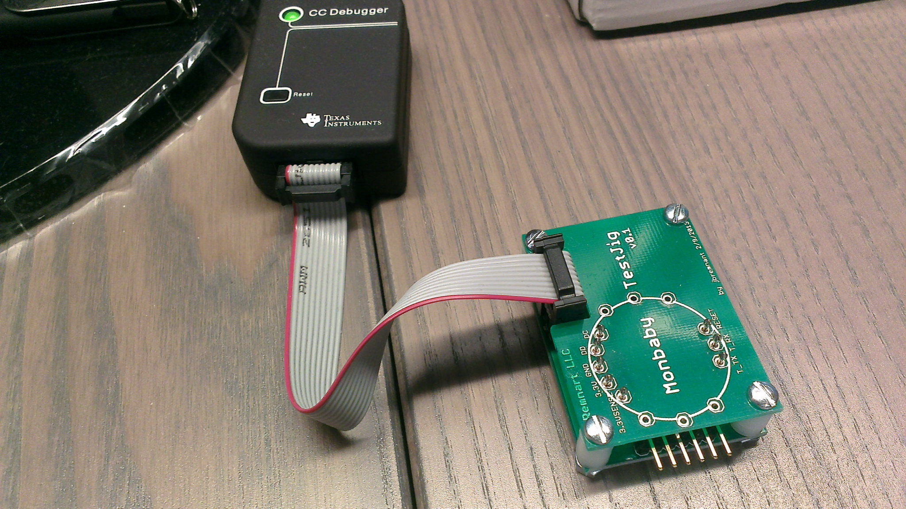 

* Mini USB cable
* TI Smart RF Flash Programmer: [http://www.ti.com/tool/flash-programmer](http://www.ti.com/tool/flash-programmer)
* DF1 assembled boards
* DF1 firmware
* Kapton 3/4 inch dot tape
* 2 Battery clips : 1 positive (strip-looking), 1 negative (flat-looking)

Step 1 : Obtain the Firmware
----------------------------

> The firmware should have been emailed to you. 
> In case you do not have it, download the zip file containing the `.hex` file from here:
>
>  [https://github.com/devicefactory/share/raw/master/hexfiles/df1_prod_201404.zip](https://github.com/devicefactory/share/raw/master/hexfiles/df1_prod_201404.zip)

> Make sure you unzip the file and find `DF1_prod_v1.3.hex` firmware file.

Step 2 : Prepare the TestJig and Software
-----------------------------------------

1. Connect the ribbon connector to the testJig. (refer to Figure 1 above)
2. Connect the mini usb cable to the CC Debugger
3. Connect the other end of USB cable to the PC
4. Download and install SmartRF Flash Programmer if the PC does not have it installed:

>  [http://www.ti.com/tool/flash-programmer](http://www.ti.com/tool/flash-programmer)
  

Step 3 : Flash the Firmware
---------------------------

1. Place the board directly on top of the test jig.
   Keep it pressed firmly with your finger to maintain electrical contact.
     
2. Press the button on the CC Debugger, and make sure the light turns GREEN.

3. Locate the DF1 firmware `DF1_prod_v1.3.hex` file you downloaded.
   On SmartRF Flash Programmer, click on button `...` to load it.

4. Under Actions, choose `Erase, program and verify`.

5. On SmartRF Flash Programmer, click on button `Perform actions` to upload the firmware.

6. If successful, the device should blink the red LED for fraction of a second once flashing is done.
   (Optional: To verify the LED blink, you can try pressing the button on the CC Debugger again.)

7. If unsuccessful, please try to make sure the device is correctly place on the jig, repeat steps 2 and 5.

   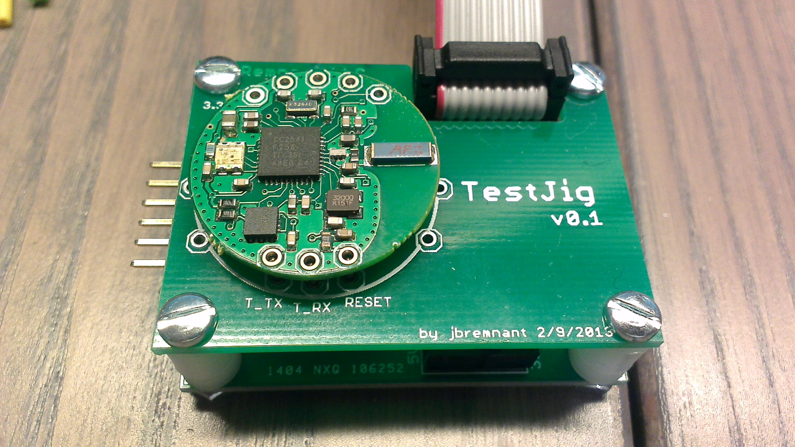 
   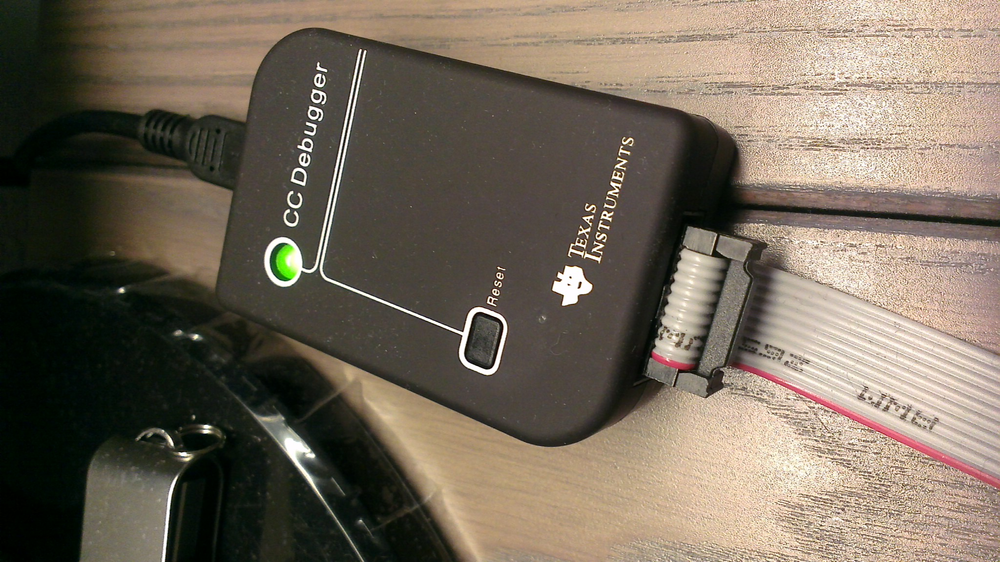 
   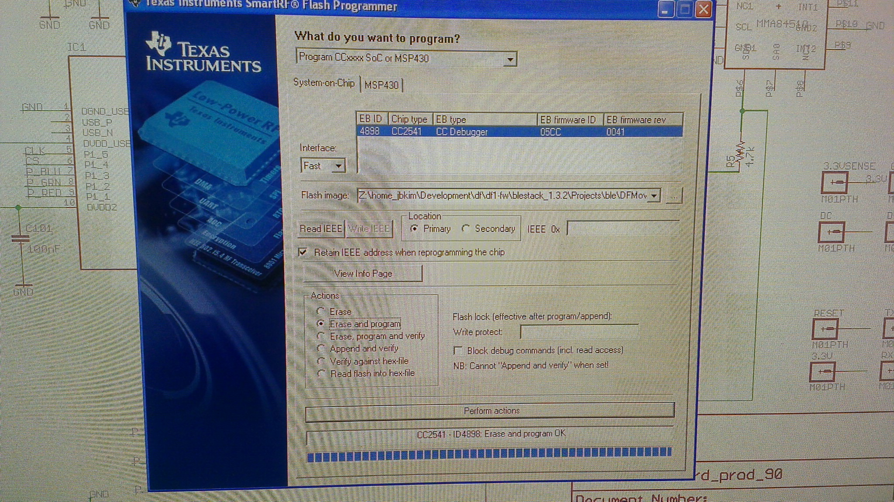 
  

Step 4: File the Nubs from the Boards
-------------------------------------

> There are 4 nubs that needs to be filed down.

   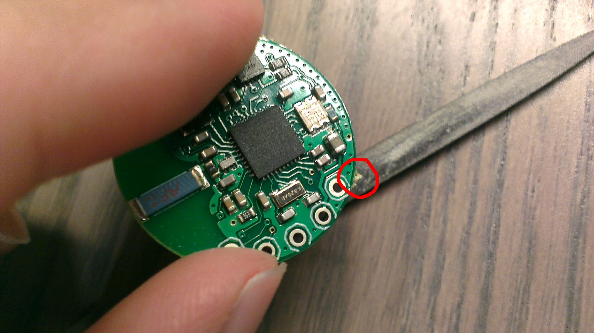 

Step 5 : Apply the Kapton Tape
------------------------------

> The Kapton tape needs to be place on the bottom-side of the PCB.
> Pictures illustrate where the tape should be placed.
> An entire roll containing 500 of these kapton dots is supplied.

   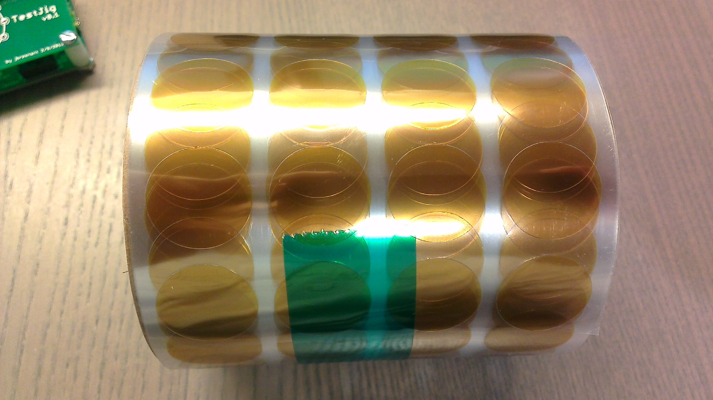 
   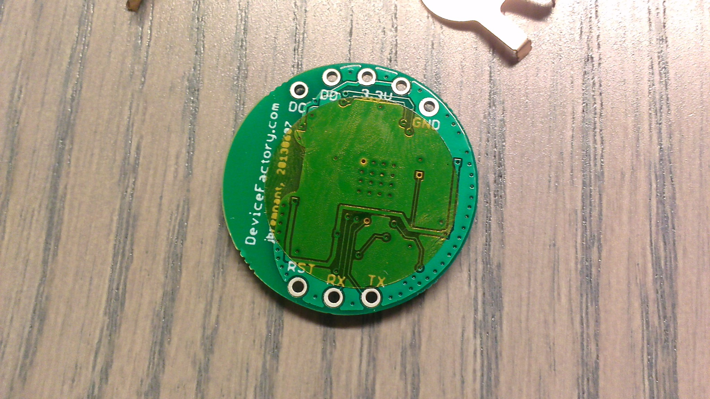 

Step 6 : Solder the Battery Clips
---------------------------------

> Solder both the positive and negative terminals.
> Refer to the picture for orientation of these battery clips.

   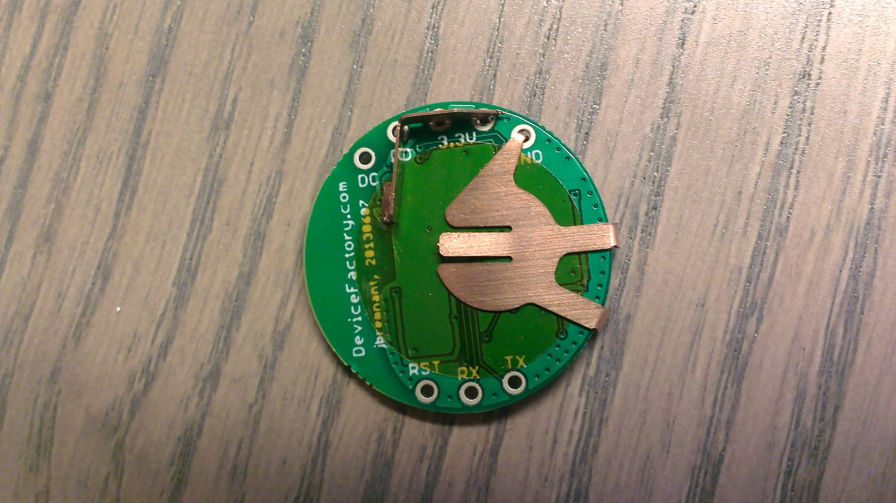 
   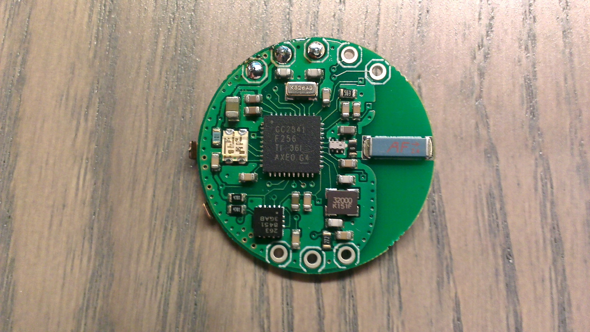 

And That's It!
--------------

The assembled boards will be placed within plastic enlosure as shown in the picture below.

    

The correctness of the battery clip assembly is paramount. This is how the clips will come in contact with the battery.

   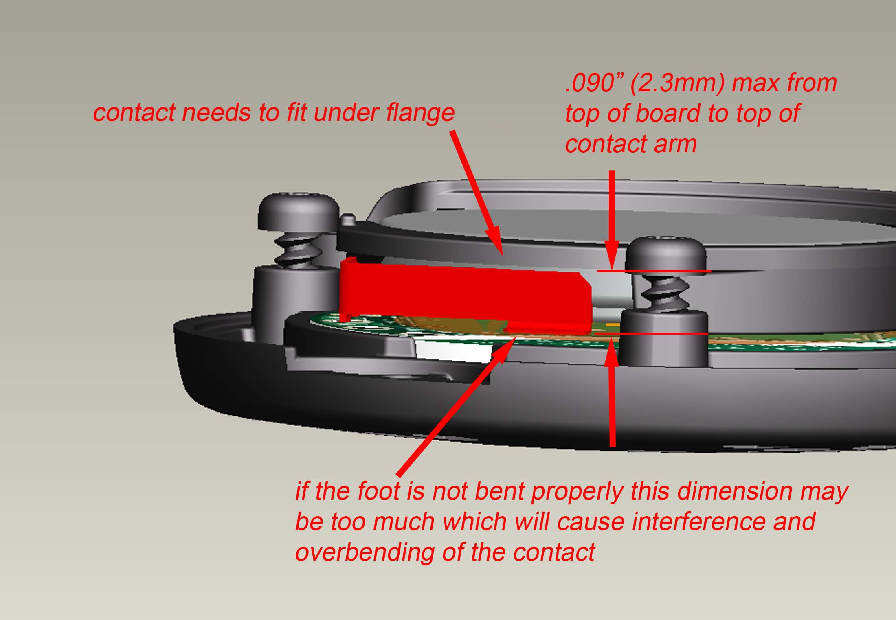 
   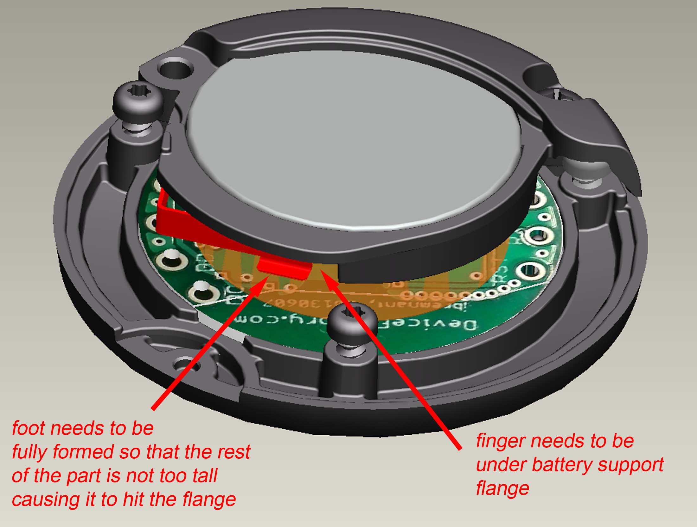 

